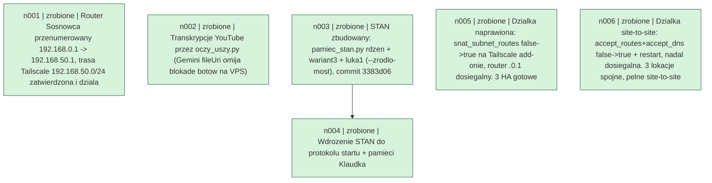

# STAN

```mermaid
graph TD
  n001["n001 | zrobione | Router Sosnowca przenumerowany 192.168.0.1 -> 192.168.50.1, trasa Tailscale 192.168.50.0/24 zatwierdzona i dziala"]
  n002["n002 | zrobione | Transkrypcje YouTube przez oczy_uszy.py (Gemini fileUri omija blokade botow na VPS)"]
  n003["n003 | zrobione | STAN zbudowany: pamiec_stan.py rdzen + wariant3 + luka1 (--zrodlo-most), commit 3383d06"]
  n004["n004 | zrobione | Wdrozenie STAN do protokolu startu + pamieci Klaudka"]
  n005["n005 | zrobione | Dzialka naprawiona: snat_subnet_routes false->true na Tailscale add-onie, router .0.1 dosiegalny. 3 HA gotowe"]
  n006["n006 | zrobione | Dzialka site-to-site: accept_routes+accept_dns false->true + restart, nadal dosiegalna. 3 lokacje spojne, pelne site-to-site"]
  n003 --> n004
  classDef zrobione fill:#d8f3dc,stroke:#2d6a4f
  classDef w_toku fill:#fff3bf,stroke:#e67700
  classDef bloker fill:#ffe3e3,stroke:#c92a2a
  class n001,n002,n003,n004,n005,n006 zrobione
```
