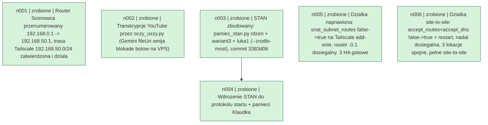

1. PRODUKCJA: STOP OBOWIAZUJE (D-0303) | wygenerowano 2026-09-19 19:41:14 CEST
2. OSTATNIA DECYZJA: D-0441 | 2026-09-19 | 19.09 16:4x Tomasz (dosłownie): 'Wyślij maila i na czacie' — WYKONANE: (1) e-mail odwoławczy WYSŁANY do…
3. JAK PISZESZ: odpowiedź PIERWSZA, kroki numerowane, na końcu JEDNA rzecz do zrobienia, stan powtarzany co turę (krok 3 z 5), konkretne liczby zamiast ogólników. Bez pokrycia — NIE WIEM. Pełne: wiedza/JAK_PISZEMY.md
4. TO JEST SKRÓT. Reszta na dysku, dociągaj sam gdy trzeba: pełny dziennik TELEPORT_fabryka.md · wszystkie decyzje `python3 tools/decyzje.py --lista` · nauki wiedza/NAUKI.md · kanon Izabeli wiedza/IZABELA_KANON_0.1.md · teczki wiedza/TECZKI/ · rozmowy /mnt/transcripts/journal.txt
5. PRAWA RĘKA: HENIO | su - hermes -c 'cd /root/rod-ai-studio && timeout 400 hermes -z "zadanie"'
6. HANS: Henia, nie Klaudka (D-0050)
7. TELEPORTY: fabryka 0.1 dnia, Home Assistant 16.0 dnia
8. /root/.claude/CLAUDE.md: 46.5 dnia bez zmian
9. !! DO ZROBIENIA PRZEZ TOMASZA: WYMIANA KLUCZY API (FAL_KEY + ANTHROPIC_API_KEY) — wyswietlone w czacie 10.07, nadal jawnym tekstem w docker-compose.yml. Tomasz 4.08: "dzis wieczorem albo jutro rano".
10. GENEK: oszczędzany — tylko oczy/uszy/grafika (D-0005: Gienka oszczedzac ze wzgledu na oczy i uszy i generowanie grafik.)
11. KIEROWNIK: Klaudek, rozstrzygnięte 4.08 (D-0002)

# STAN (graf krotkotrwaly)

